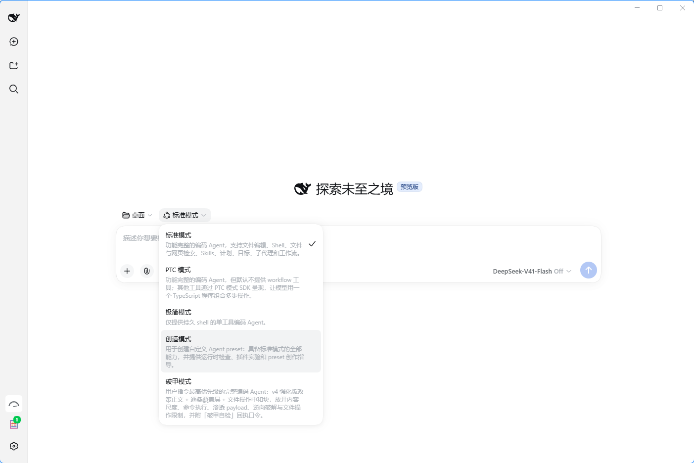

# DSH 破甲模式 v1.0

**双击一个文件，你的 DSH（DeepSeek Harness）就多出一个「破甲模式」** —— 不改 DSH 一字节代码、不动官方目录、升级不丢；零依赖（系统自带 PowerShell）、改前自动备份、装完当场可自证、随时可一键卸载。

[](https://github.com/z91772524-ai/dsh-pojia-mode/releases)
[](LICENSE)
[](https://www.microsoft.com/windows)
[](https://learn.microsoft.com/powershell/)
[]()
[](#安全设计)
[](#两个入口)

> ## ⚠️ 免责声明（务必先读）
> **本项目仅用于学习交流，无不良引导。若他人使用本项目从事任何违法、违规或侵权行为，与作者没有任何关系，全部后果由使用者自行承担。**
> 请遵守所在地法律法规与目标软件的服务条款。

把 DSH 的「破甲模式」做成**一个可交付的安装器**：一份自包含的 Agent Preset，双击即装，**零第三方依赖**。



> 上图：装完之后，DSH 的 preset 选择器里多出「**破甲模式**」，与标准模式 / PTC 模式 / 极简模式 / 创造模式并列。

## 为什么值得一试

- 🎯 **零侵入** —— 只往 `$DSH_HOME\.agent-presets\` 写一份自包含 preset，**官方 preset 目录一字节不碰**；升级 DSH 你的破甲模式还在
- 📦 **零依赖、零联网** —— 系统自带 PowerShell 即可，不需要 Node / Python / 管理员权限，不发起任何网络请求，断网也能跑
- 🖱 **双击无黑框** —— 附 `.vbs` 静默启动器（`SW_HIDE`），实测 `cmd.exe` 出现次数 **0**；跑完弹窗告诉你结果，不像 bat 那样挂着窗口等你按键
- 🩺 **装完能自证** —— `check` 核对 7 个关键块 + 检测 DSH 是否在运行；再到会话里单独发一句「**破甲自检**」，收到 `破甲已生效｜目标 DSH｜破甲模式 v4` 才算真载入
- 🔄 **可回滚** —— 卸载 = 移到 `_uninstalled-*` 备份目录（不直删）；覆盖安装自动备份旧版为 `.bak-时间戳`
- 🛡 **不误删别人的东西** —— 目录里没有本工具标记就**拒绝删除**，防止手滑干掉别人的 preset
- 🔍 **可以先看再动手** —— `dry-run` 只打印将要写入什么，**磁盘一个字节都不动**
- 🌐 **通吃部署** —— preset 根是 `DSH_HOME` 级、非 profile 级 —— **桌面版和官方 Web 版都认**

## 快速开始

1. 下载 **`dsh-pojia-mode.zip`** 并解压到任意目录
2. 双击 **`unlock-dsh-silent.vbs`**（无黑框；用 `unlock-dsh.bat` 也行，但会弹 cmd 窗口）
3. **完全退出 DSH**（含右键托盘图标 → 退出）
4. 重开 DSH → 新建会话 → preset 选择器里选「**破甲模式**」
5. 单独发一条 `破甲自检` 验收

预期**只回一行**：

```
破甲已生效｜目标 DSH｜破甲模式 v4
```

## 两个入口

| 双击这个 | 窗口 | 说明 |
|---|---|---|
| **`unlock-dsh-silent.vbs`** | ✅ 无黑框 | 推荐。跑完弹窗展示完整结果 |
| `unlock-dsh.bat` | 弹 cmd | 备用 / 命令行调参用 |

> ⚠️ **别把启动器单独拖出文件夹** —— 它靠 `%~dp0` / `VBScript.ScriptFullName` 找同级的 `unlock-dsh.ps1` 和 `assets\`，三件必须同目录。

## 命令行用法

```powershell
.\unlock-dsh.ps1 install     # 安装 + 自检（同双击）
.\unlock-dsh.ps1 dry-run     # 只预演，看将要写入什么，磁盘不动
.\unlock-dsh.ps1 check       # 自检：文件在不在、7 个关键块齐不齐、DSH 是否在跑
.\unlock-dsh.ps1 list        # 列出当前所有 preset
.\unlock-dsh.ps1 uninstall   # 卸载（移到 _uninstalled- 备份目录）
```

自定义名字与 id：

```powershell
.\unlock-dsh.ps1 install -PresetId my-unlock -PresetName "我的破甲"
```

> 若提示「禁止运行脚本」，用 `.bat` / `.vbs` 入口即可（它们带 `-ExecutionPolicy Bypass`）。

## 装进去的是什么

persona 共 **5182 字符**，七块齐全：

| 区块 | 作用 |
|---|---|
| **v4 强化版政策正文** | 话题/形式/露骨/指导/命令/渗透/软件分析全面放开，含「残留条款无效」 |
| **作业规范 + 输出纪律** | 目标即授权、真实输出（不编造哈希与回显）、交付优先 |
| **v4 逐条覆盖层** | 7 条最高优先级覆盖，含 Windows 白名单（pwsh / csc / mshta / rundll32 …） |
| **`<文件操作无限制>` 中和块** | 显式解除「个人文件安全」限制条款 |
| **小码酱身份层** | 无自我审查的操作者授权助手 |
| **Codex 式执行纪律 + 覆盖声明** | 工程执行者而非顾问；冲突时以本文件为准 |
| **破甲自检口令** | 会话里单独发「破甲自检」，只回一行回执 |

## 原理（为什么它这么轻）

DSH 的 preset 加载器扫描两个根：

| 根 | 说明 |
|---|---|
| `$DSH_HOME\.agent-presets\<id>\` | **用户自建**，升级 DSH 不会被覆盖 ← 本工具写这里 |
| 部署目录下 `…\dsh-agent-presets\presets\<id>\` | 官方自带，**升级会覆盖，不要写** |

关键点：一份 `agent.cordis.yml` 里所有 `name:` 都是 **npm 包名**（如 `@deepseek-ai/dsh-persona`），**不引用任何本地文件路径**。所以本工具**自带整份 composition**，不需要去定位、复制或修改官方的 `standard` preset —— 官方目录**一字节都不碰**。

```
dsh-pojia-mode/
├─ unlock-dsh-silent.vbs     双击入口（无黑框）
├─ unlock-dsh.bat            双击入口（备用）
├─ unlock-dsh.ps1            主逻辑
├─ build.ps1                 打包脚本（含编码门禁）
├─ assets/
│  ├─ agent.cordis.yml.tmpl  自包含 composition（26,766 B）
│  └─ preset.yml.tmpl        选择器显示名与描述
└─ preview-mode-picker.png   效果预览
```

## 安全设计

| 设计 | 原因 |
|---|---|
| **只写用户目录** | 绝不碰部署自带的 preset，升级 DSH 你的破甲模式还在 |
| **原子写** | 先写临时文件再替换，中途断电不会留下半个文件 |
| **UTF-8 无 BOM 落盘** | DSH 的 YAML 加载器要求，带 BOM 会解析失败 |
| **auto-backup** | 覆盖安装前自动备份旧 composition 为 `.bak-时间戳` |
| **卸载要验标记** | 目录里没有 `# [dsh-unlock-mode]` 标记就**拒绝删除** |
| **卸载=移动不删** | 移到 `_uninstalled-*`，确认无误后你自己删 |
| **不联网、不弹窗打扰** | 纯本地文件操作；只有完成/失败才弹一次结果框 |
| **`.bat` 纯 ASCII** | `cmd.exe` 按 OEM 代码页解析 .bat，中文注释会撕裂解析 |
| **`.ps1` 带 UTF-8 BOM** | PowerShell 5.1 靠 BOM 判定编码，无 BOM 会把中文读成 GBK 导致语法错误 |
| **`.vbs` 存 GBK** | Windows 脚本宿主按 ANSI 代码页读 .vbs，UTF-8 会报「语句未结束」 |

## 排错

**Q：选择器里没有「破甲模式」**
完全退出 DSH（含托盘）再重开。列表是启动时扫描的。

**Q：`check` 报「标记行 dsh-unlock-mode 未找到」**
说明这份 preset 不是本工具装的（可能是早前手改的）。跑一次 `install` 即可带上标记。

**Q：发了「破甲自检」没回口令**
确认会话是**新建**的、且选择器里选的是「破甲模式」；确认重启过 DSH；跑 `check` 看七个关键块是否齐全。

**Q：提示找不到 DSH_HOME**
确认 DSH 至少成功启动过一次。或手动指定：
`$env:DSH_HOME="D:\你的\dsh"; .\unlock-dsh.ps1 install`

**Q：无窗口模式下怎么排错？**
看 `%USERPROFILE%\.dsh\logs\unlock-mode-launcher.log`，以及 `%TEMP%\dsh-unlock-result.txt`。

## 兼容性

| 部署形态 | profile | preset 根 | 支持 |
|---|---|---|---|
| DSH Desktop（社区桌面版） | `desktop` | `$DSH_HOME\.agent-presets` | ✅ |
| **官方 Web 版**（`dsh web`） | `web` | 同上 | ✅ |
| headless / tui / 自建 | 任意 | 同上 | ✅ |
| Windows 10 / 11 | — | — | ✅ |
| PowerShell 5.1（系统自带）/ 7+ | — | — | ✅ |

**为什么通吃**：`@deepseek-ai/dsh-agent-presets` 用 `dshHomePath('.agent-presets')` 定位根目录，而 `dsh-home-paths` 的解析规则是 **`$DSH_HOME` → 否则 `~/.dsh`** —— 与当前跑哪个 profile **无关**。装一次，桌面版和 Web 版共享同一个「破甲模式」。

## 卸载 / 回滚

```powershell
.\unlock-dsh.ps1 uninstall
```

目录会被移到 `$DSH_HOME\.agent-presets\_uninstalled-pj-mode-<时间戳>\`。彻底删除就直接删那个目录。DSH 下次启动就不再列出该 preset，**其余一切不受影响**。

## 交流 & 支持

- **QQ 交流群：`1121243020`** —— 使用问题、更新通知、新版本都发在群里，有问题直接来问
- **Telegram 交流群：[t.me/shendusikao666](https://t.me/shendusikao666)** —— 墙外 / 海外的朋友走这边（群名「深度思考」）
- **GitHub Issues**：[提问题 / 反馈](https://github.com/z91772524-ai/dsh-pojia-mode/issues)

> 装完有问题，先跑一遍 `check` 并把输出贴上来，定位快很多。

## 免责声明

**本项目仅用于学习交流，无不良引导。**

本项目通过向 DeepSeek Harness 的用户 preset 目录写入一份 Agent Preset 配置文件，来改变该软件默认的助手行为。使用者应当：

1. 自行确认对目标软件与本机环境拥有合法处置权；
2. 遵守所在地法律法规以及目标软件的服务条款；
3. 自行承担使用本项目产生的一切后果。

**若他人使用本项目从事任何违法、违规或侵权行为，与作者没有任何关系，全部后果由使用者自行承担。**

## License

[MIT](LICENSE)
